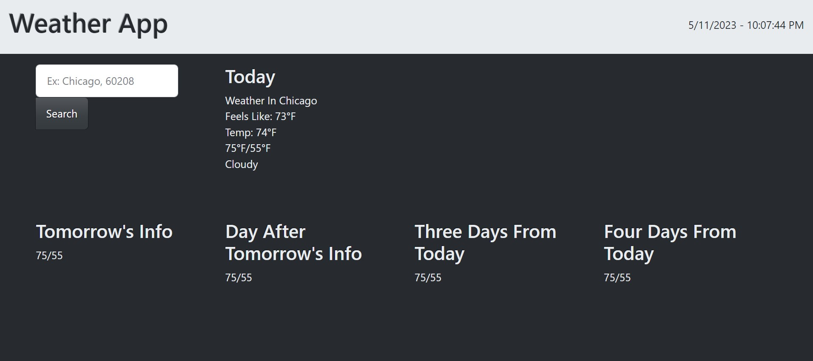
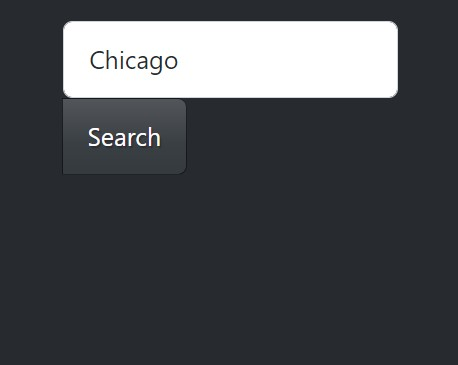

# Weather App
## This is a weather app built with JavaScript that retrieves and displays weather information using the OpenWeatherMap API.

# Getting Started
## To use this application, open the GitHub Page link to open the web page. The current date and time will be displayed at top. In the search field enter a location name. The web application will populate the weather forecast.

# Usage
## To use the app, enter the location you want to check the weather forecast for in the search bar and click on the "Search" button. The app will display the five day forecast of the location. The app will save your location searched to local storage and populate the data based on the previous search the next time the page is visited. The weather app will display today's Feels Like Temperature, Actual Temperature, High/Low, Humidity, Wind information, the weather description as well as the icon image for the weather. The Weather App will display the high/low temperatures, wind information, humidity, the weather description as well as the icon image of the weather.

# API Used
* OpenWeatherMap API [(https//openweathermap.org)](https//openweathermap.org)

# Images
## Landing Page

## Search Bar

## Page after Search was clicked

# Link to GitHub Page
[GitHub Page](https://athur1104.github.io/WeatherOrNot/)